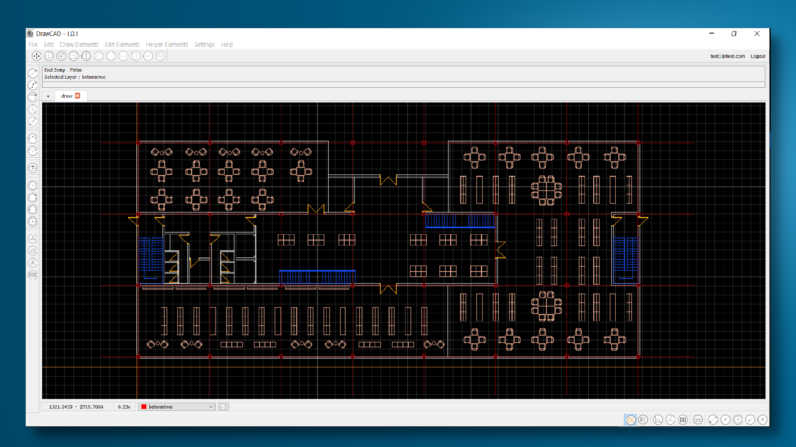

<hr>
<h6 align="center">
  <a href="https://docs.drawprogram.org">DrawCAD |</a>
  <a href="https://docs.drawprogram.org/doc">Doc |</a>
  <a href="https://docs.drawprogram.org/api">Api |</a>
  <a href="https://docs.drawprogram.org/geo">Geo |</a>
  <a href="https://docs.drawprogram.org/auth">Auth</a>
</h6>

<hr>
<h3>DrawCAD</h3>
<p>
Basic level technical drawings can be made with DrawCAD, which is a technical drawing program. It is designed to be used in technical drawings of fields such as architecture and engineering. Drawings can be made with many commands such as line, polyline, rectangle and circle, and these drawings can be edited with commands such as move, mirror and scale. Point with Snap tools. Capturing operations can be performed and drawings can be made at right angles and angles with polar mode and ortho mode. With the layer system, adjustments can be made to the features of the drawn elements such as line thickness, color and pen type. Before using the program, you must register with your username and password and then log in. Drawings can be saved to the cloud system or locally with a unique file format (.df).

</p>
<p>
The client works using four services. Services are by default
It works at <a href="https://github.com/mzahidberber/Draw-Api">drawprogram.org</a>, but if you want to test it locally, you can use it with docker compose. In order to use the services locally, you must enable the local addresses in the Core/Url/Urls.py file.
</p>

```
class Urls(enum.Enum):
    drawgeo="http://localhost:5001/geo"
    drawapi= "http://localhost:5000"
    drawauth= "http://localhost:5002"
    server="https://localhost"
```

<h3>Quick Start</h3>
<p>You can start the source code to use it. Before starting, some Python libraries must be installed.</p>

```
# Python 3.10.11
pip install -r requirements.txt
python Run.py
```


<h3>Services</h3>
<div align="center">
  
</div>
<p>
DrawCAD software has a modular structure consisting of four services on backend and one client on the frontend. Three of the services in the backend are of the restapi type and communicate with each other with the json data type. The fourth service is a mysql service and data is kept in this service. API and auth services are written in C# and geo and client python language. The services are virtualized with docker on the server and communicated with each other.
</p>
<h3>Start</h3>
<p>You can use docker compose to use it. It downloads the images of the services from dockerhub and runs them.</p>

```
docker-compose up -d
```


